[Home - AD163](/README.md#exercises)

# Exercise 2: Create a Shopping Cart business object, projection and service with the Graphical Modeler in SAP Build Code

## Introduction

In this exercise, you will create a shopping cart business model with two entities, ...

### Exercises

- [Model the Shopping Cart Business Object](#exercise-model-the-shopping-cart-business-object)
- [Model the Shopping Cart Projection](#exercise-model-the-shopping-cart-projection)
- [Model the Shopping Cart Service](#exercise-model-the-shopping-cart-service)
- [Shortcut in case of modelling problems](#shortcut-in-case-of-modelling-problems)
- [Generate the RAP service](#exercise-generate-the-rap-service)
- [Summary & Next Exercise](#summary--next-exercise)  

> **Reminder:**   
> Don't forget to replace all occurences of the placeholder **`###`** with your suffix or Group ID in the exercise steps below.

## Exercise: Sign in to SAP Build Code and open the SAP Build Code Storyboard
[^Top of page](#)

1. Click on the project created in the last exercise to start **SAP Build Code**. 

   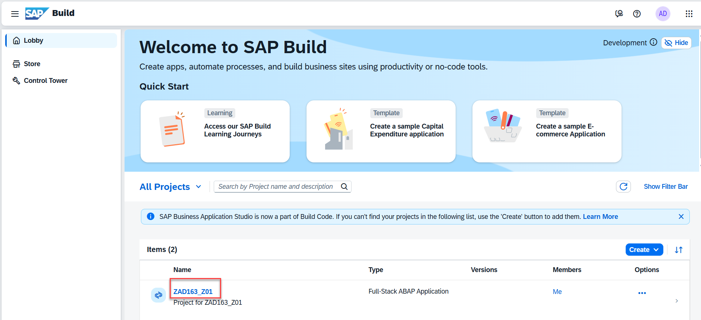   

2. This opens the SAP Build Code Storyboard with your project.   
Open the Business Objects modeller view by clicking the plus symbol **`+`** under **Create an entity** in the section **Business Objects**.

   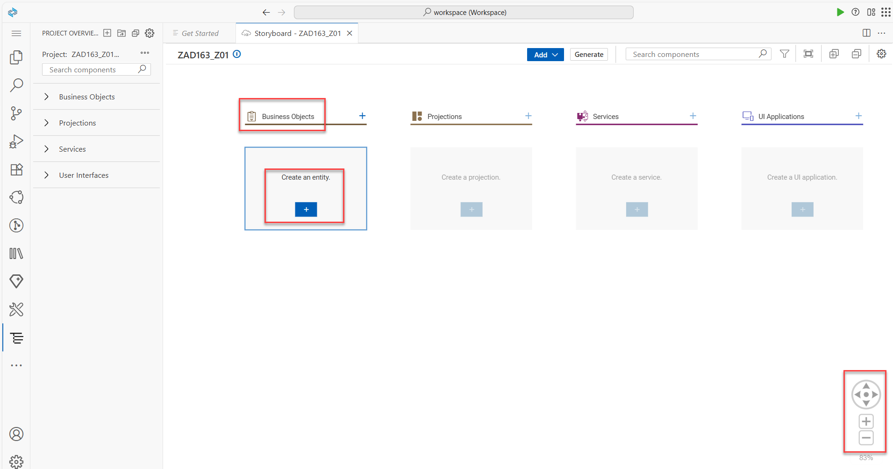   

> **Hint:**   
> Using the elements in the lower right corner you navigate and adopt the view of your model if it doesn't fit correctly in your screen.   

## Exercise: Model the Shopping Cart Business Object
[^Top of page](#)

> Note: The Business Object Modeler that has just opened uses an **ZAD163_###.abap.csn** file to store the model defintion. This file resides on your ABAP system in the package you created in Exercise 1. You should not edit this file manually since this can damage the integrity of the model.  
To speed up the creation of a model it is possible to use an existing csn file as a template.  
If you don't manage to model the business object you can use a csn file provided in this script as a template as described here: [Shortcut in case of modelling problems](#shortcut-in-case-of-modelling-problems).  

### Model the entity `Cart`

   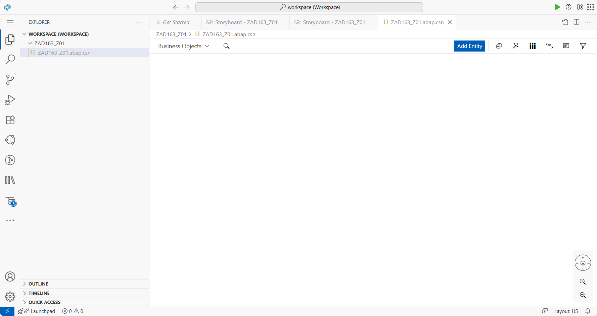

1. In the Business Object modeler press **Add Entity** and drag the new entity to the center of the work area. The name **Entity1** is highlighted and you can use your keyboard to input **'Cart'** right away. Else, double click on the name **Entity1** to select and change the name.

   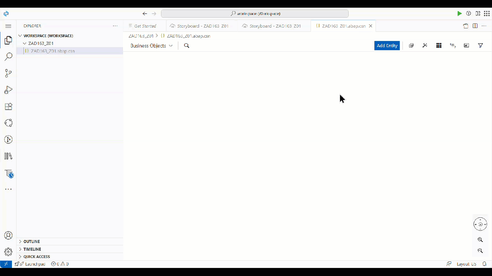

2. Add a label for the **Cart** entity by selecting the entity with a click, then on the appearing right-side menu of the entity select **Show Details**. In the now opened details pane add **ShoppingCart** as the label.

   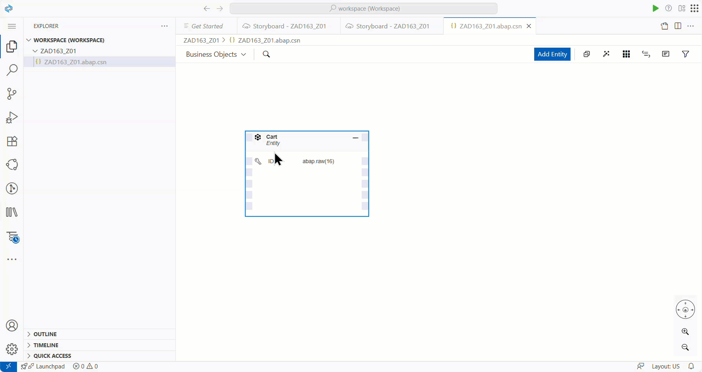

3. On the right hand side of the `Cart` entity click on the button **Set Root Entity**. 

   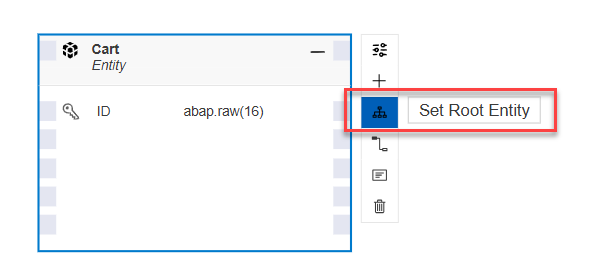

3. In the next steps we will add the following properties to the **`Cart`** entity. 
In addition we will rename the pre-generated **ID** property to **OrderUuid**.

> ⚠️ Please be sure to use the above mentioned name **OrderUuid** in CamelCase and do NOT use **OrderUUID** because this would lead to different field names on table level. This behavior will be changed in a future release.

| **Property name**  | **Type**     |  **Length** or **(Precision/Scale)**  |   
|--------------------|--------------|--------------| 
| **OrderUuid**       |  **raw**     |     **16**  |       
| OrderID             | numc         |     8       |       
| RequestDeliveryDate | datn         |     -       |
| Notes               | char         |    100      |

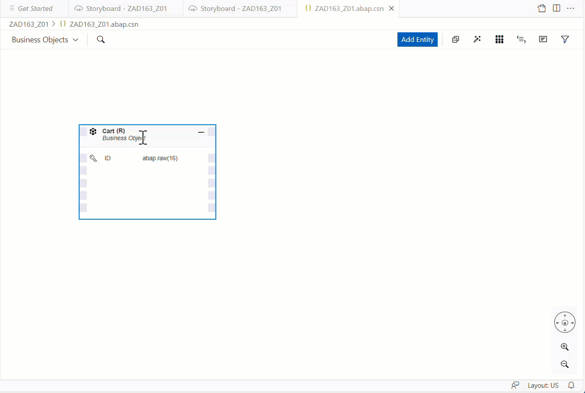

4. To add and maintain properties of the `Cart` entity we will use the build-in property editor. To open the property editor click on entity name `Cart (R)` and then choose **Show Details** on the right hand side.

   - Start with renaming **ID** to **OrderUuid**:  
   To rename the pre-generated **ID** key field click on the field in the property editor and just change the name to **OrderUuid** and press **Enter** or press the plus sign **`+`** to create a new property.  
   - In the newly created property field enter the values from the table above, e.g.:     
     - enter **OrderID** in the **Name** field   
     - select **numc** from the drop-down list in the **Type** field and  
     - enter **8** in the **Length** field   

   - Proceed the same way for the properties **RequestDeliveryDate** and **Notes**.   

   - In addition to the fields mentioned above we want to add a field **TotalPrice** that shall contain a _price_ which requires a _currency_.   
   For fields of this type the behavior in the editor is slightly different:    
     - Add a new property.   
     - Fill **TotalPrice** for the name and select the type **curr**. This will add precision and scale fields where you enter **11** for precision and **2** for scale.  
     - The property is missing the Currency field. This is why the field is now marked with a red box. 
     - To create and add the missing currency field open the details dialog of the property by clicking on the right-pointing arrow next to the property. 
     - Scroll down to **Currency** and enter here **Currency**. Press **Enter** and close the dialog with **OK**. 

     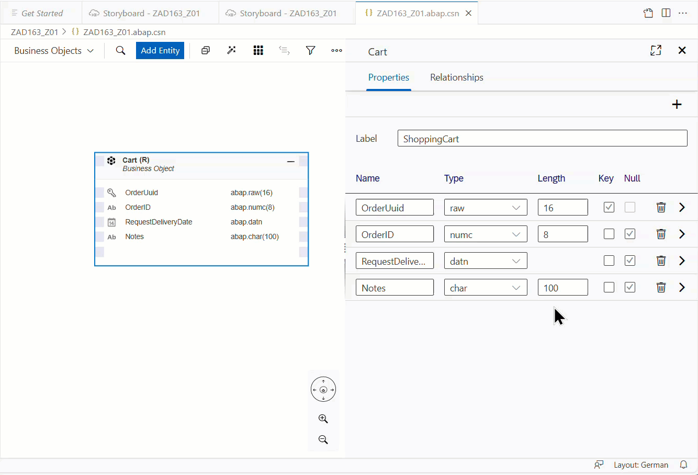

You are now all set with the `Cart` entity which should look like follows. 

and it shall contain the following fields:   

| **Property name**  | **Type**     |  **Length** or **(Precision/Scale)**  |   
|--------------------|--------------|--------------| 
| **OrderUuid**       |  **raw**     |     **16**  |       
| OrderID             | numc         |     8       |       
| RequestDeliveryDate | datn         |     -       |
| Notes               | char         |    100      |
| TotalPrice          | curr         |    (11/2)   |
| Currency            | cuky         |     -       |

### Model the entity `Item`

1. In the next steps we will add the following properties to the **`Item`** entity. 
In addition we will rename the pre-generated **ID** property to **ItemUuid**.

> ⚠️ Please be sure to use the above mentioned name **ItemUuid** in CamelCase and do NOT use **ItemUUID** because this would lead to different field names on table level. This behavior will be changed in a future release.

 | **Property name**  | **Type**     |  **Length** or **(Precision/Scale)**  |    
 |--------------------|--------------|--------------|
 | **ItemUuid**       | **raw**      |     **16**   |       
 | ParentUuid         | raw          |    16        |
 | ItemID             | numc         |     8        |
 | OrderedItem        | char         |    40        |
 | Quantity           | numc         |    4         |

2. To add the entity `Item` click **AddEntity** and change the name to **Item**.

3. To add a label for the **Item** entity select the entity with a click. On the appearing right-side menu of the entity select **Show Details**. This will open the details pane where you can add **Item** as the label.

4. Rename the **ID** field to **ItemUuid**, leave type and length as given.

5. Add the remaining properties mentioned in the table above.

   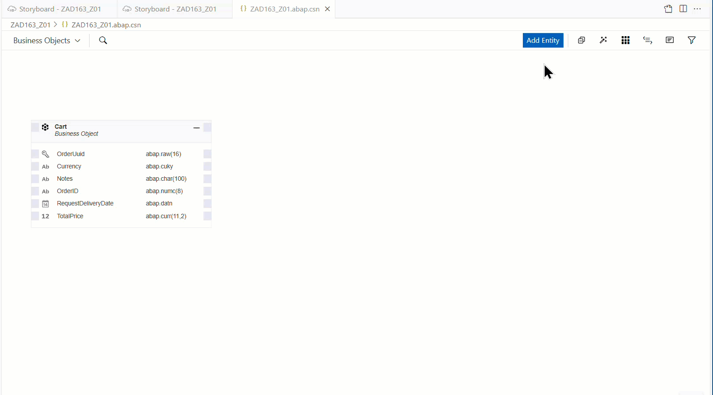
 

> Some explanations:  
> The field `ParentUuid` is needed to store the value of the Uuid based key field of the Parent Node **Cart**. Starting from the third level of a grandchild entity one would have to add a second Uuid based field called `RootUuid` to store the value of the Uuid based key field of the root entity. 

> We will finally add two fields of type price that contain the price of a single unit and the price of the item **ItemPrice** = **Quantity** * **UnitPrice**.   

6. **ItemPrice**  
   - Add a new property. 
   - Fill **ItemPrice** for the name and select the type **curr**. This will add precision and scale fields where you enter **11** for precision and **2** for scale.  
   - The property is missing the Currency field. This is why the field is now marked with a red box. 
   - To create and add the missing currency field open the details dialog of the property by clicking on the right-pointing arrow next to the property. 
   - Scroll down to **Currency** and enter here **Currency**. Press **Enter** and close the dialog with **OK**.    

7. **ItemUnitPrice**   
   - Add a new property. 
   - Fill **ItemUnitPrice** for the name and select the type **curr**. This will add precision and scale fields where you enter **11** for precision and **2** for scale.   
   - The property is missing the Currency field. This is why the field is now marked with a red box. 
   - To fill this open the details dialog of the property by clicking on the right-pointing arrow **`>`** and select the previously created field **Currency** from the drop down box.  

   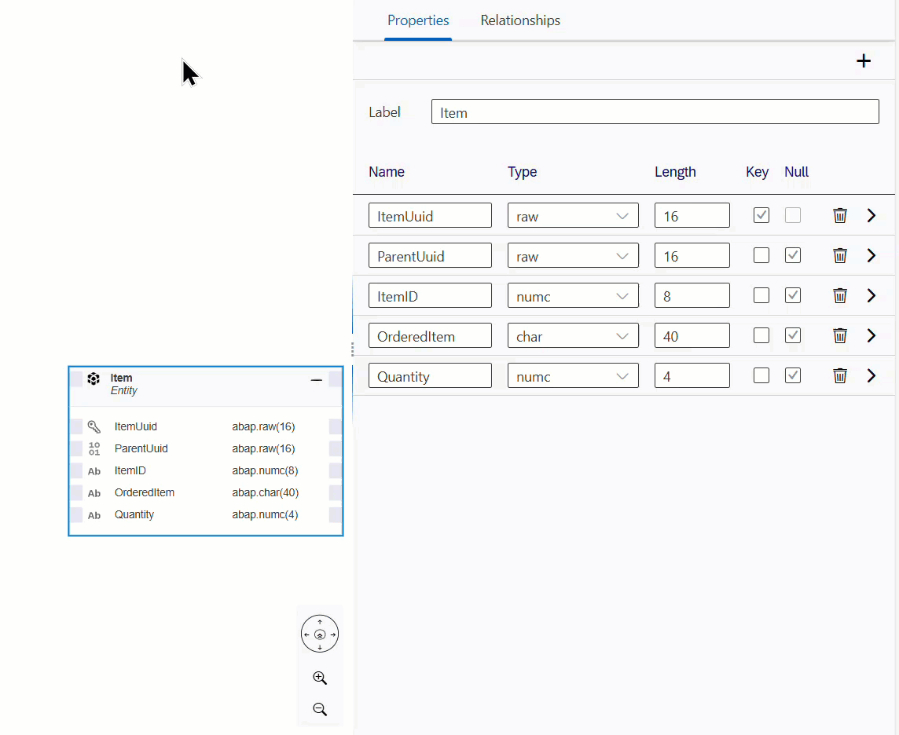   

 The item entity shall now contain the following fields:     

 | **Property name**  | **Type**     |  **Length** or **(Precision/Scale)**  |    
 |--------------------|--------------|--------------|
 | **ItemUuid**       | **raw**      |     **16**   |       
 | ParentUuid         | raw          |    16        |
 | ItemID             | numc         |     8        |
 | OrderedItem        | char         |    40        |
 | Quantity           | numc         |    4         |
 | ItemPrice          | curr         |    (11/2)    |
 | ItemUnitPrice      | curr         |    (11/2)    |
 | Currency           | cuky         |     -        |

### Create a composition

Create a composition relationship between **Cart** and **Item**. 

1. Select the entity **Cart** and select **Add Relationship** from the menu on the item. 
   - Now drag the relationship arrow to the **Item** entity and click to release.    
   - In the relationship dialog select **Composition** and **To-Many** .   
   - Now select in the Relationship Details for **Item** the field **ParentUuid** instead of the key field **ItemUuid**.     

   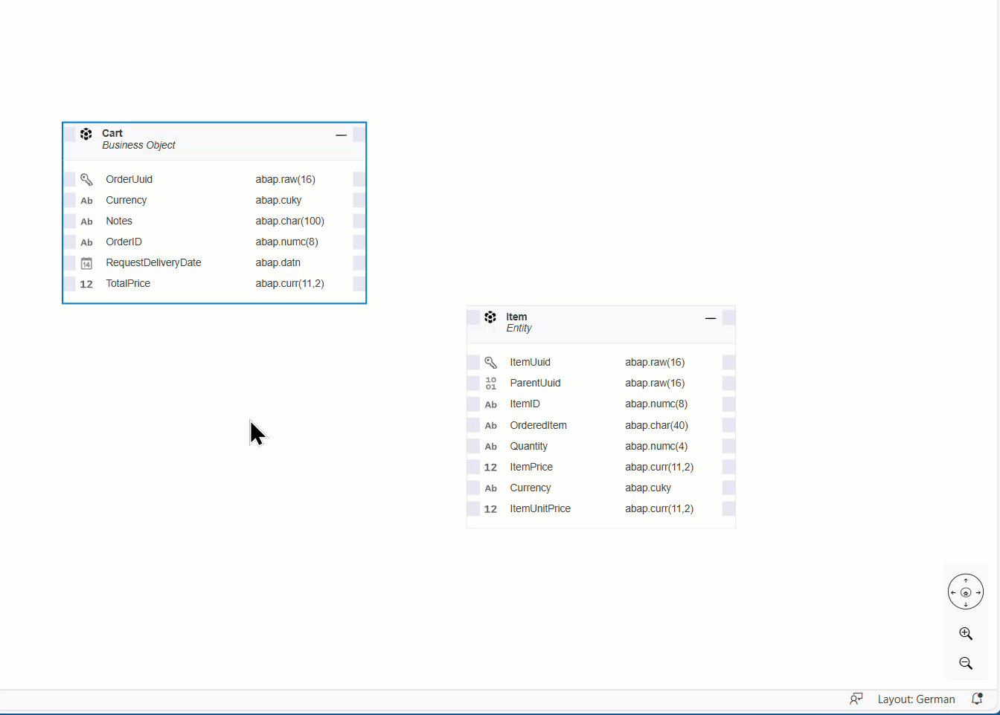

2. Your result should look like this:

   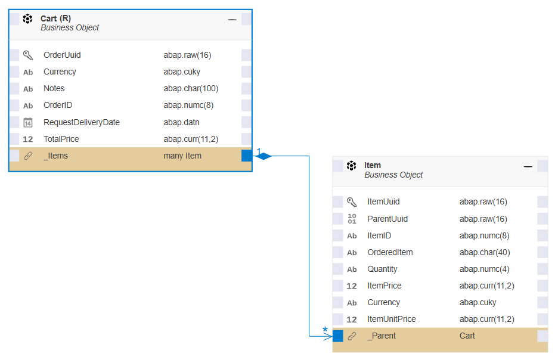

You can now close the Business Object Modeler and return to the storyboard.

## Exercise: Model the Shopping Cart Projection
[^Top of page](#)

Using the the Business Object Modeler we can now add a projection layer on top of our business object. We will select all fields that we have created in our business object layer. 

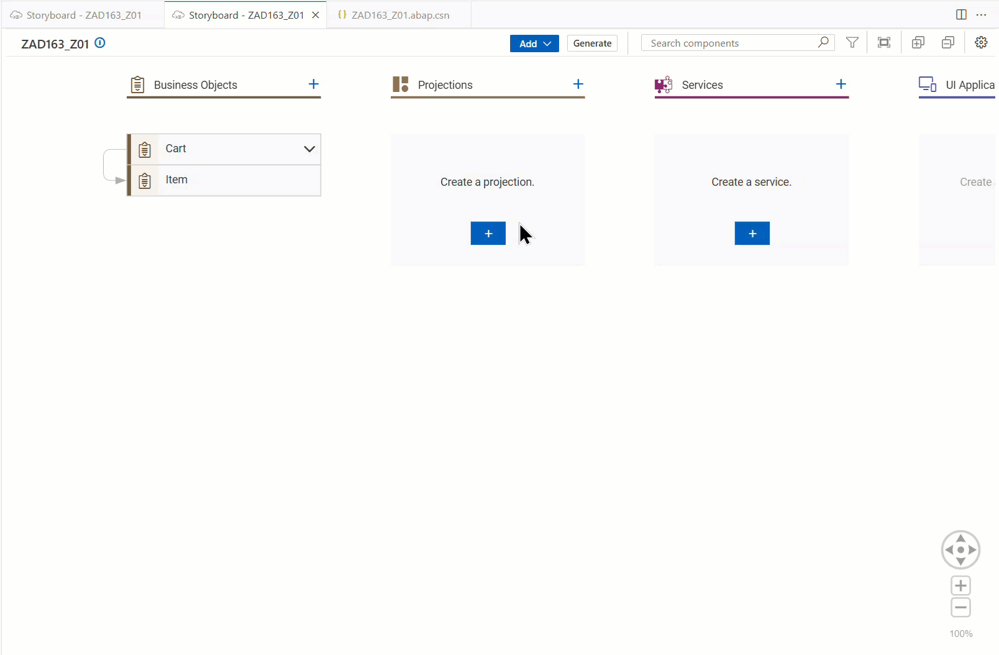

1. In the storyboard click **+** under **Create a projection**.

2. Click **Add Projection** in the Projection modeler. Drag the empty projection to the center of the screen and release.

3. Now select a base type for the projection. On the right hand side in the **Projection** pane, click the drop down and select **businessobject.Item**. Keep all properties selected and confirm to fill the projection.

4. Add a second element to the projection with **Add Projection**. This will automatically assign **businessobject.Cart** as base type. Confirm the fields in the **Projection** pane.

5. The composition relationship was automatically created. Your result should now look like this:

   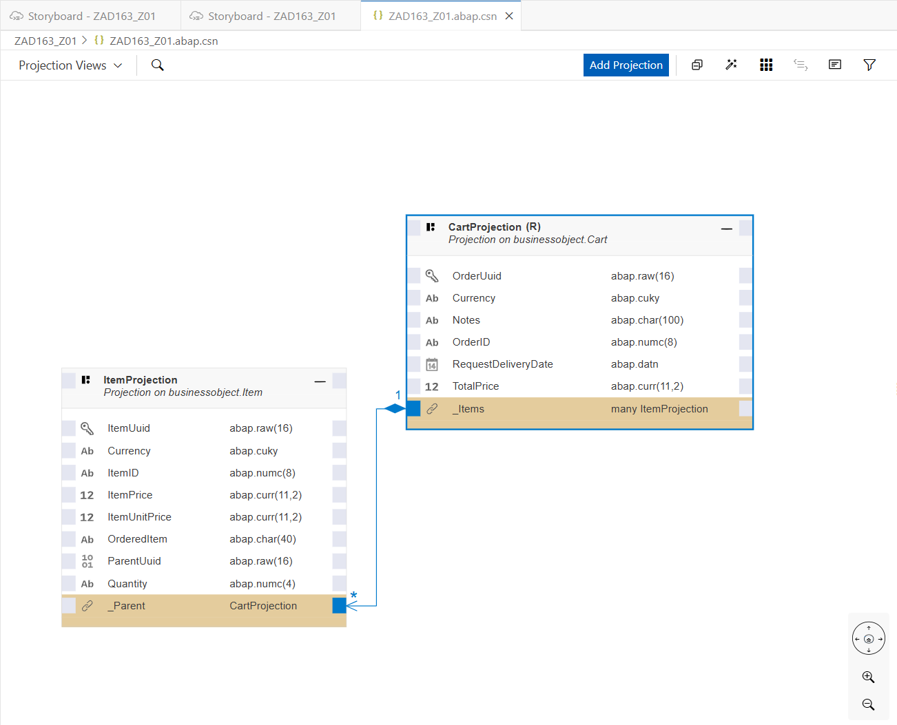

You can now close the Projection modeler and return to the storyboard.

## Exercise: Model the Shopping Cart Service
[^Top of page](#)

After having created the projection layer we have to add a service layer. Here we will select all entities that are going to be exposed by the service and we will mark the `Cart` entity as the leading entity.   

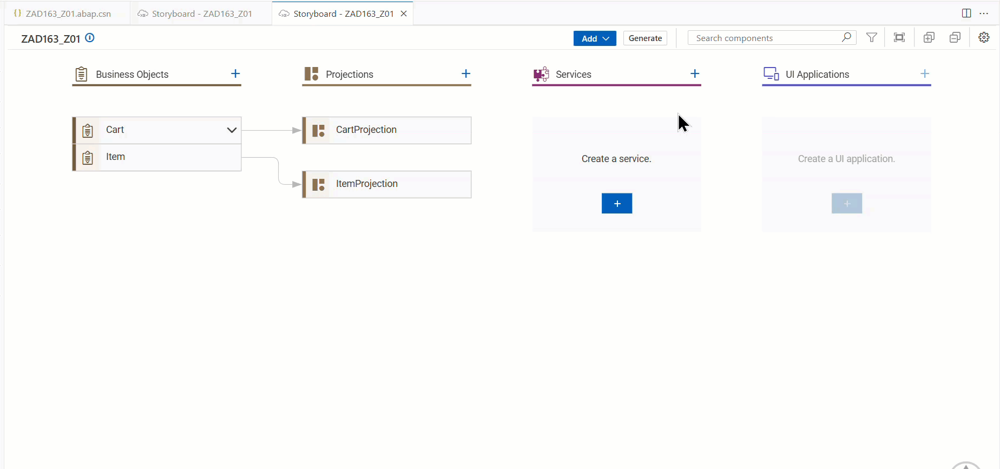

1. In the storyboard click on the plus sign **`+`** under **Create a service**.

2. Add a service by clicking **Add Service** and dragging the empty service to the center of the modeler.  

3. Rename the service to **CartService**.

4. Open the details pane and select both entities to be part of the service and mark the `CartProjection` entity as the **Leading Entity**.  

ℹ️ Your resulting model with business object, projection and service layer should look like this:

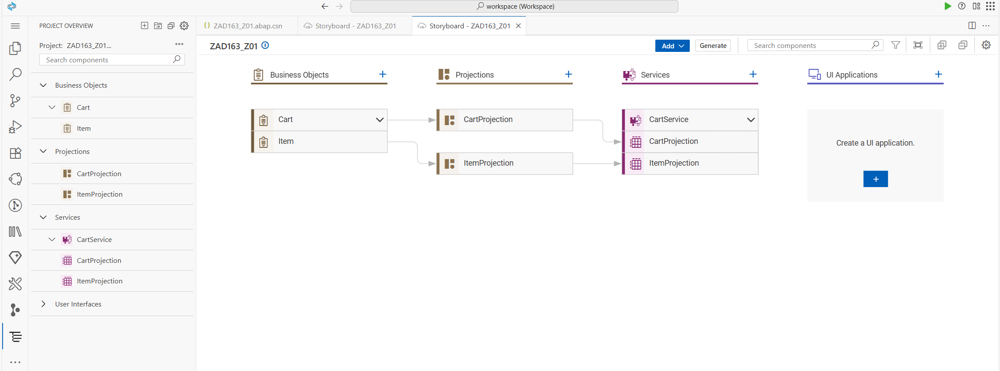

You are now all set to generate the ABAP backend artefacts from the modeled business object, projection and service. Close the service modeler and return to the storyboard.

## Shortcut in case of modelling problems

If you have not succeeded in modelling your RAP service we have provided the following shortcut.   

Click here only in case of modelling problems, otherwise proceed with generating the service

- In SAP Build click on the generated project --> BAS will be openened
- Select **Add** --> **Business Object Entity**   
- Click on **Add Entity**   
- Ignore the generated entity and click on the **Open CDS Editor (TEXT)** Icon

  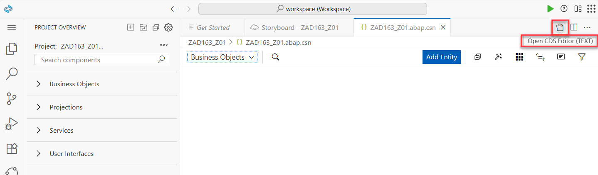

- In the new tab cut and paste the content of the following json:
  [csn file solution](../../csn_files/csn_with_labels.json)
- Close the tab

- The tab with the Graphical Editor should now look like in the screen shot below

  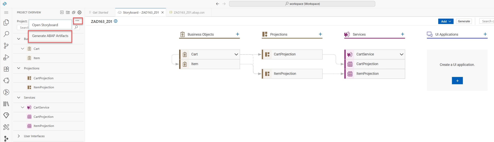    

## Exercise: Generate the RAP service
[^Top of page](#)

1. To generate the ABAP backend artefacts click **Generate** on top of the storyboard.

2. ⚠️⚠️⚠️ As the **Artefact prefix** you have to select your group ID:  

 | **Event name**                          | **Artefact Prefix**                   |  
 |----------------------------------------|---------------------------------|       
 | **ASUG TechConnect in Louisville**       | **A##**                                |     
 | **SAP TechEd Berlin**                    | **B##**                                | 
 | **TechEd On Tour - Bangalore 2025**                    | **C##**                                | 
| **TechEd On Tour - Sydney 2025**                    | **D##**                                |

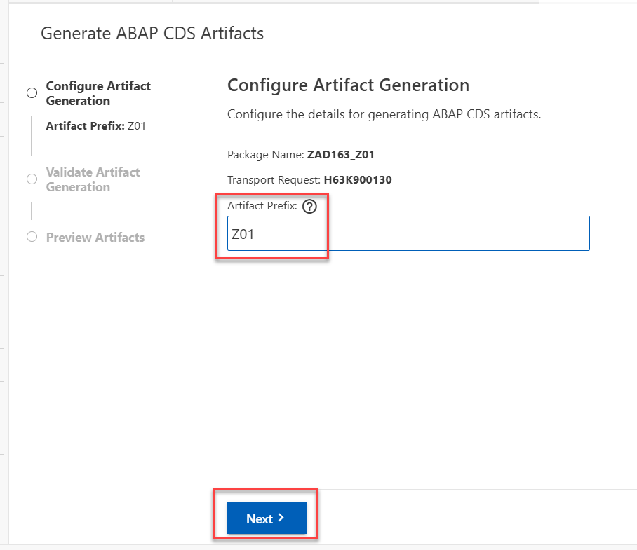

3. Click **Next** to advance. Now the generation is being validated. The validation should show the message **The status is OK**.

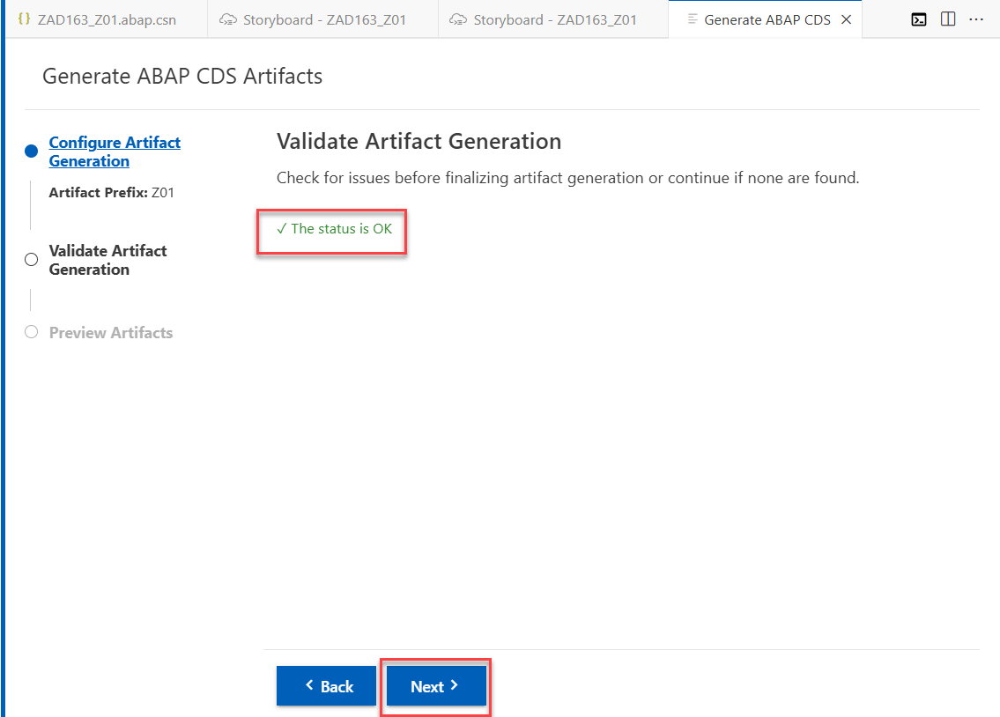

4. Advance with **Next** to preview the to be generated artefacts and click **Finish** to start the generation.  

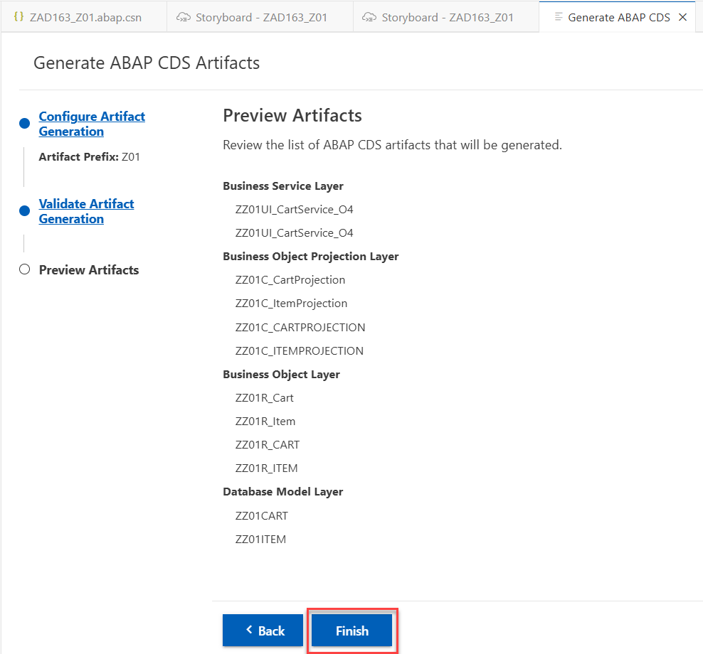

5. The generation might take a few minutes as the artefacts are being generated, activated and the service published.

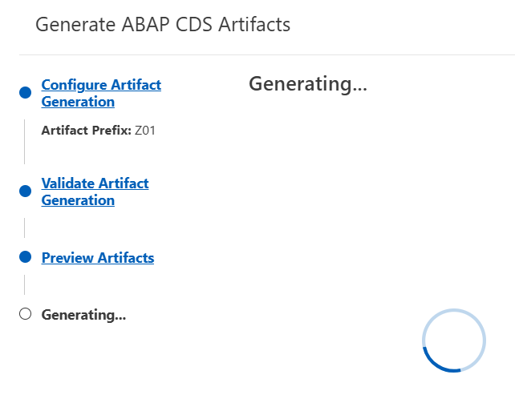

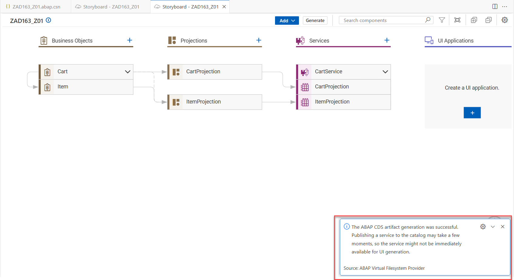

## Summary

You have used the Graphical Modeller to model in Business Application Studio (BAS) and you have generated a (read-only) RAP service. This service will be CRUD-enabled in **[Exercise 3: Implement transactional behavior in ADT, create validations and determinations](../ex3/README.md)** by adding the missing behavior definition and behavior projection.  

[^Top of page](#)

You can now continue with **[Exercise 3: Implement transactional behavior in ADT, create validations and determinations](../ex3/README.md)**.

[^Top of page](#)
