[Home - AD163](/README.md#exercises)

# Exercise 4: Create, preview and adapt a SAP Fiori elements application

## Introduction

In the previous exercise using the ADT preview feature you have seen how a basic SAP Fiori elements application can look like based on your service. In this exercise, you will create a SAP Fiori elements application project in Business Application Studio. To verify the result you will preview the application in the development environment. Finally you will add capabilities to your UI that cannot be configured by using backend annotations alone. 

### Exercises
<!-- 
- [4.1 - Create the application](#exercise-41-)
- [4.2 - Preview the application](#exercise-42-)
- [4.3 - Adapt the application](#exercise-43-)
- [4.4 - Add a custom element](#exercise-44-)
- [Summary & Next Exercise](#summary--next-exercise)  
-->
> **Reminder:**   
> Don't forget to replace all occurences of the placeholder **`###`** with your suffix or Group ID in the exercise steps below.
> If you haven't been assigned a Group ID, select a combination of three (3) numbers and/or letters, such as e.g. **`A00`** or **`B56`**.  

## Exercise 4.1: Create the application

1. In the Storyboard click on `+` under **UI Applications**

   
2. Business Application Studio opens the **SAP Fiori Generator** with the **Template Selection** screen
    - Select **List Report Page**
    - Press **Next >**

3. The **Data Source and Service Selection** screen is pre-filled. Press **Next>**
   
5. In the **Entity Selection** screen the `CartProjection` is pre-selected as the **Main Entity**. We keep the other values' defaults. Press **Next>**
    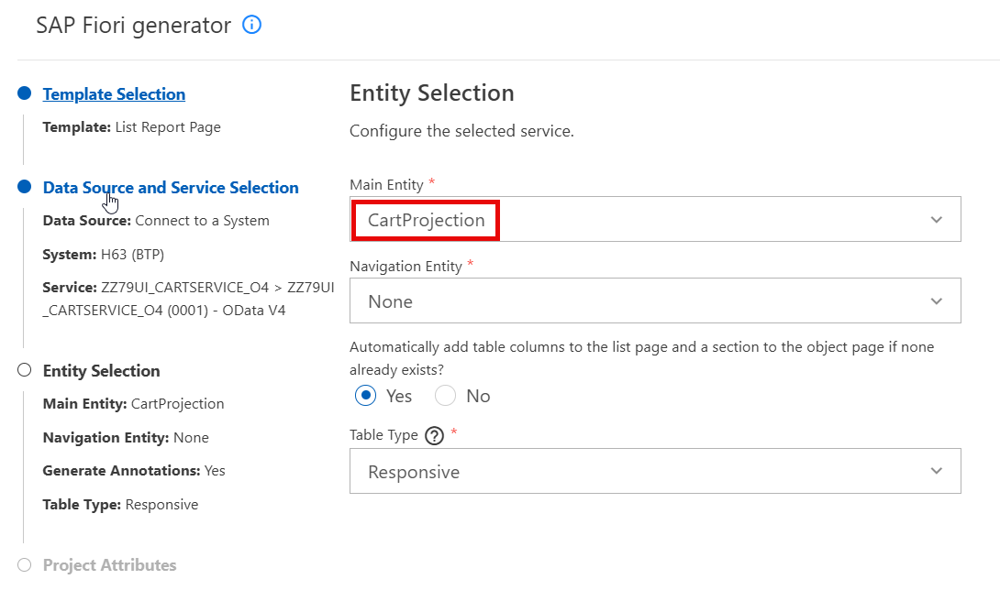  

6. In the **Project Attributes** enter the following values and press **Finish**.  

     > Hint: Your **Module Name** must be in lowercase letters.

     - Module Name: `ad163u###`
     - Application Title: `Shopping Cart App AD163U###`
     - Application Namespace: _leave empty_
     - Description: `My shopping cart app`
     - Enable TypeScript: `No`
     - Add deployment configuration: `No` 
     - Add FLP configuration: `No`
     - Use virtual endpoints for local preview `Yes`   
     - Configure advanced options: `No`

     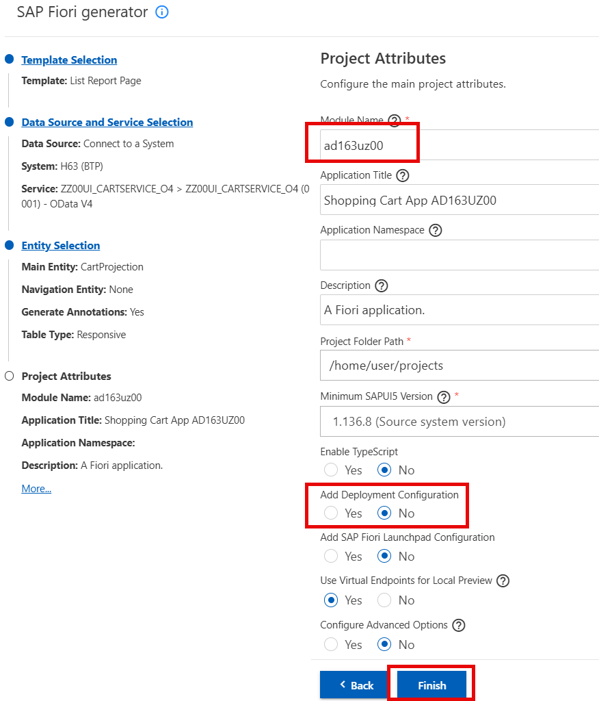

7. At this point the creation of the app is in progress, which can take a few moments, and once finshed the **Application Information** page opens automatically.

## Exercise 4.2: Preview the application

1. Before we can preview the application, we are going to use AI features provided by Joule and SAP Fiori tools to create semantically rich mock data. For this click on the **Open Page Map** tile in the Application Information.

   >**Note.** In order to use Joule you need a subscription to SAP Build Code or have signed up for [SAP Build Code Test Drive](https://help.sap.com/docs/link-disclaimer?site=https%3A%2F%2Fdevelopers.sap.com%2Fmission.sap-build-code-test-drive.html%3Fsap-outbound-id%3D4E44C2A19D38B160BF5539329FA7ECC83942C1AD). For more information, see What is [SAP Build Code](https://help.sap.com/docs/build_code/d0d8f5bfc3d640478854e6f4e7c7584a/504854f457cc4fbf9f79136dbc773618.html)

   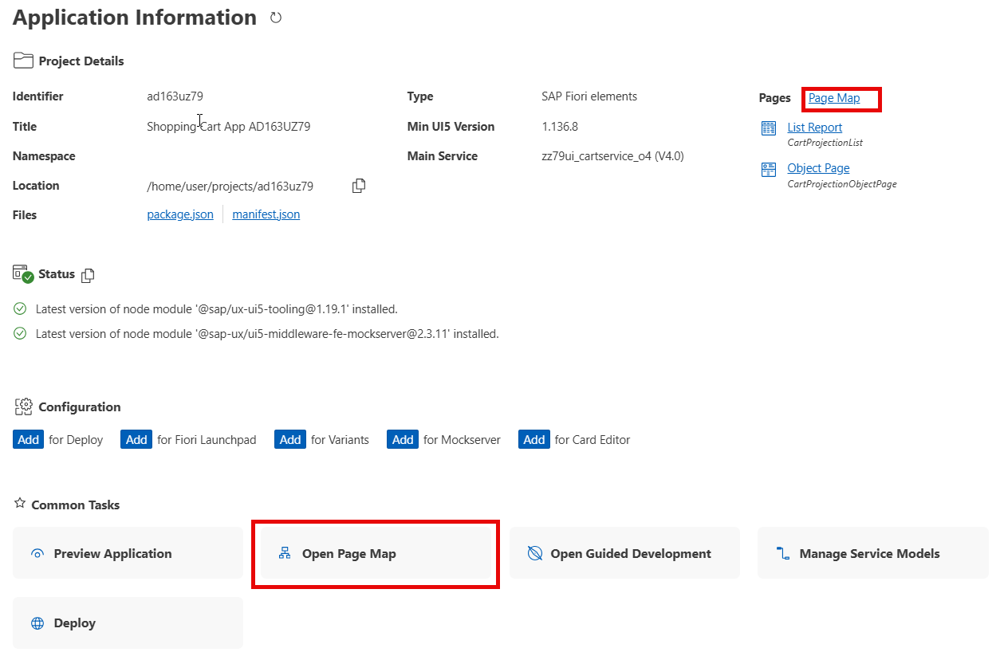

2. In the Page Map, which display the structure of the application, select the icon for **Generate Mock Data with AI**, and confirm the popup with **Generate**. Wait until the generation is finished.
   
   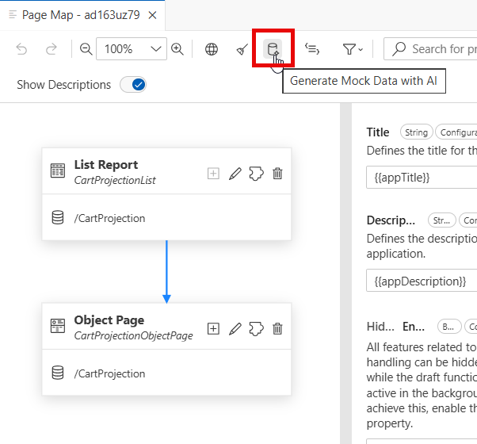

3. Back on the **Application Information** page select **Preview Application**  

   >**Hint.** You can open the Application Information also through the menu > View > Command Palette > search and select Application Information.

4. From the **Preview Options** select the third entry **start-mock** to preview the app with our AI generated mock data.

   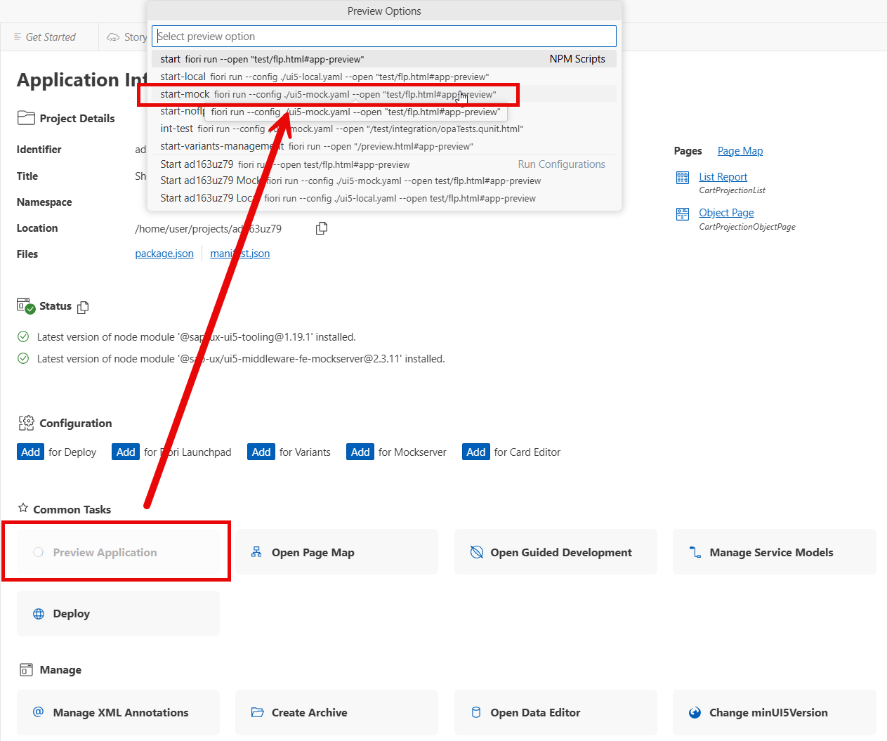 

5. A popup might show up telling you that a service is listening on port 8080. No action needed.

6. When the browser opens automatically, press **Go**. Then you can click on an entry in the list to navigate to the detail page. 

   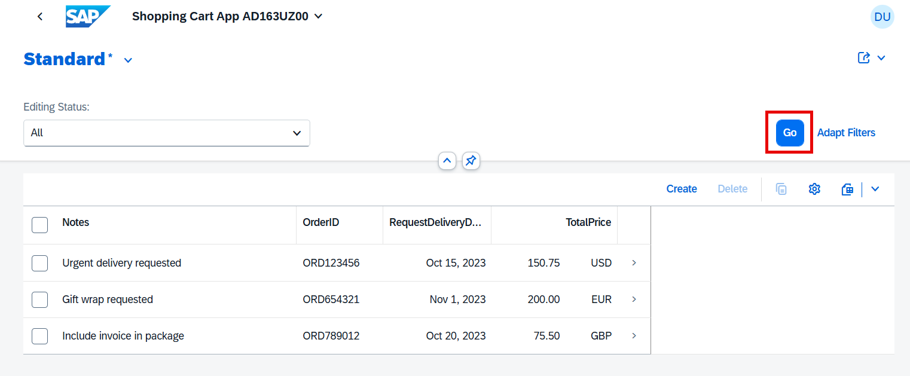
   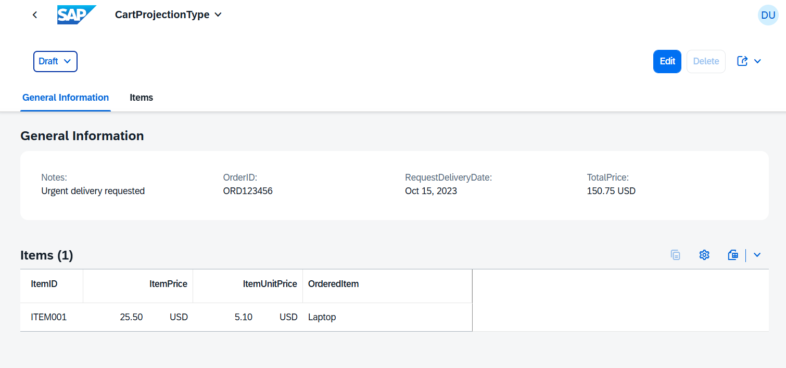
   
8. Keep the preview running for the next exercise, you can take out the browser tab as a new window to the side of your screen.

## Exercise 4.3: Adapt the application

After having created a SAP Fiori elements list report application, that is so far completely driven by annotations provided by the RAP business object in the backend, we will now perform two changes to the UI that need to be done by modifying the **manifest.json** file of your project.  

- Choose the **Flexible Column Layout** which allows the user to see more details on one screen.
- Enable **Initial Load**, that data is loaded automatically, so that you don't have to press the **Go** button on the list report.   

We will do these tasks using the **SAP Fiori tools**.

1. On the **Application Information** page select **Open Page Map** again. You can proceed if the Page map is still open.

 

2. Enable the **Flexible Column Layout** and choose **Mid-Expanded** in the details.

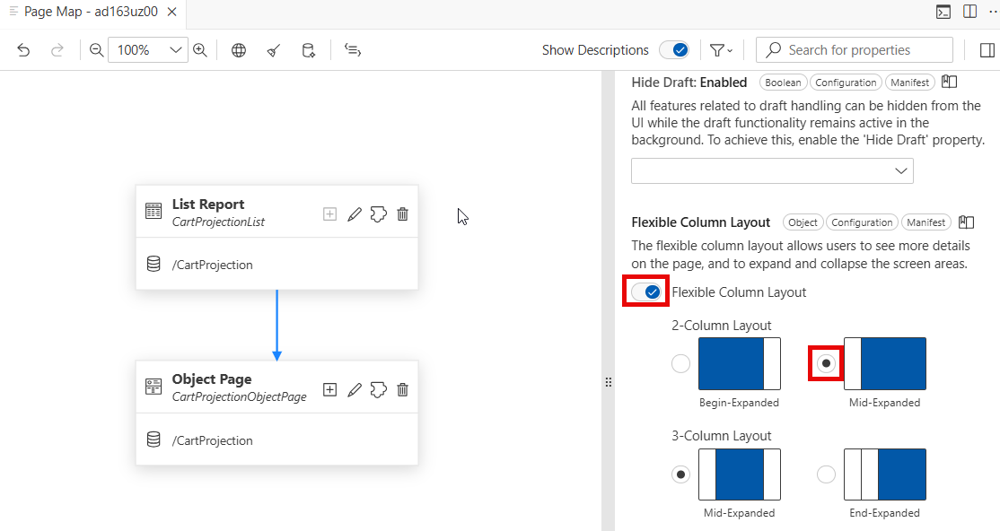 

3. Now open the **Edit** mode of the **List Report**   

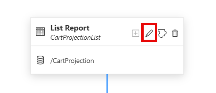 

4. Search for "Initial" in the search filter bar of the Page Editor and change the value of **Initial Load** to "Enabled".

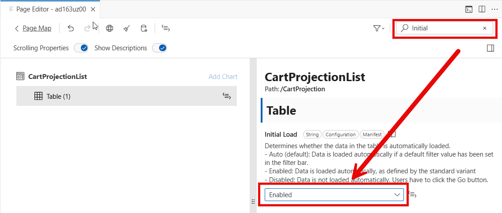 

5. Switch back to the preview window of your application which got auto-refreshed with your changes, do a reload and observe the table being populated without pressing the "Go" button. Now select an order and observe the flexible column layout in action.

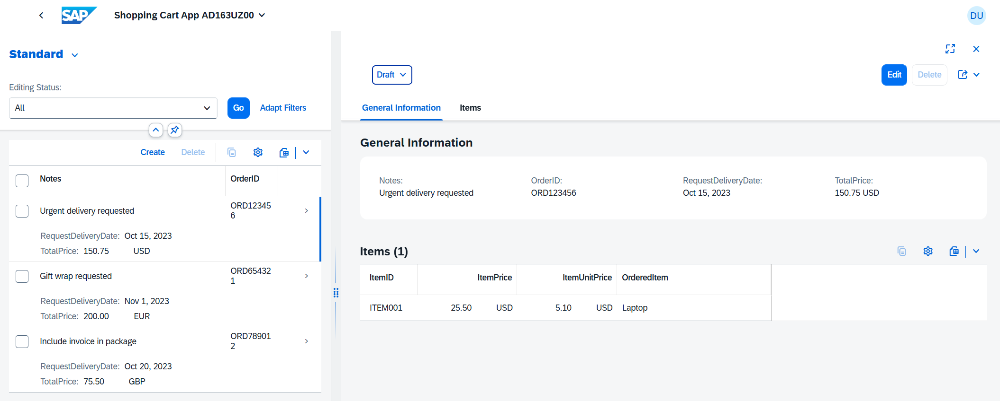 

## Exercise 4.4: Add a custom element

In the last exercise we will enrich the object page with a custom section, where we will use the Rich Text Editor building block from SAP Fiori elements to get more options for maintaining the "Notes" property. Building blocks are an easy way to enhance apps with custom coding by still leveraging the benefit of the SAP Fiori elements' metadata-driven approach. For more details about this topic refer to [SAP Fiori Development Portal](https://ui5.sap.com/1.141.0/test-resources/sap/fe/core/fpmExplorer/index.html#/).

We will again be using the **SAP Fiori tools** for this task.

1. In the **Page Map** select the pencil icon of the object page to open the **Page Editor** for this page.

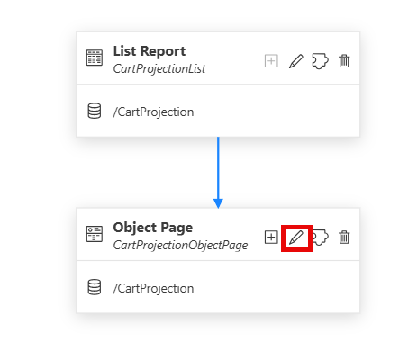 

2. The Page Editor shows the outline of the page on the left and the properties on the right, when you click a node in the outline. Navigate to the **Sections** node, press the plus button, and add a **Custom Section**.

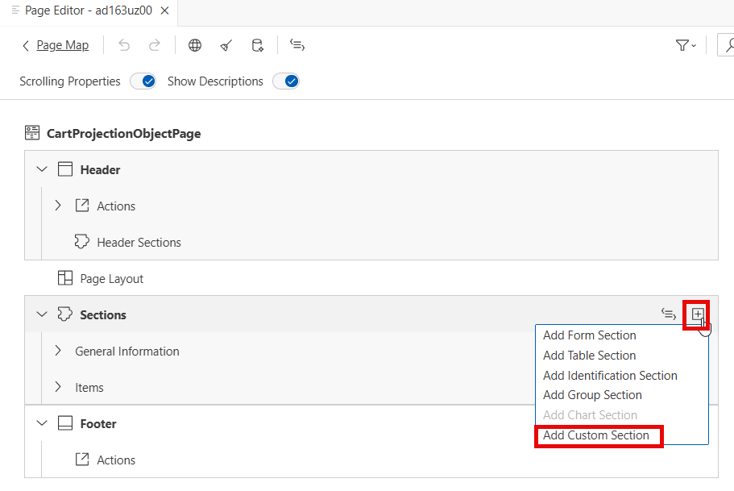

3. In the popup enter/choose the following values and press **Add**.  

     - Title: `Notes`
     - Create New Fragment
     - Fragment Name: `TextEditor`
     - Anchor Section: `General Information`
     - Placement: After
     - No event handler

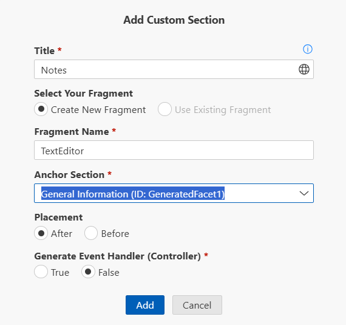

4. Open the new Notes section and add the Rich Text Editor as building block.

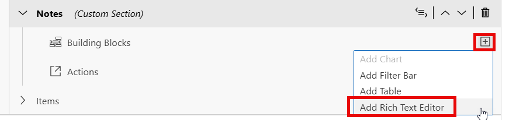

5. In the popup choose the values seen in the screenshot and press **Add**. As the detail page where we place the building block is bound to the main entity set, choose "Absolute" as binding context. The aggregation path specifies where in the XML fragment the building block shall be placed. Each new custom section created with the Page Editor gets a default `VBox` control to frame its content, we place it inside.

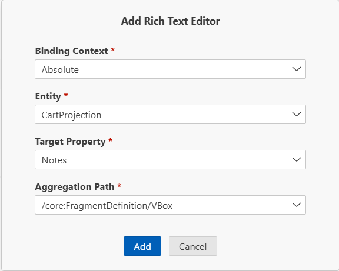

6. Let's have a look at the generated code in the XML fragment, select the node for the Rich Text Editor building block in the outline and press the **Edit in Source Code** button.

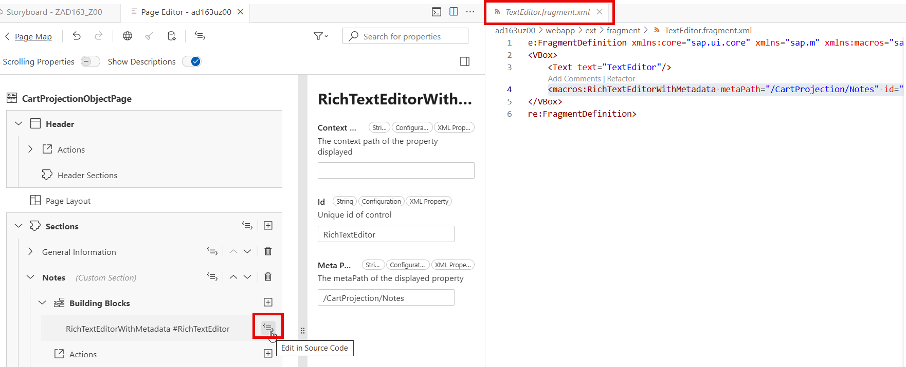

7. You will notice the building block (namespace `macros`) and a placeholder text created when we added the custom section. The placeholder is not needed any longer, and can be deleted. Remove the code line 3. 

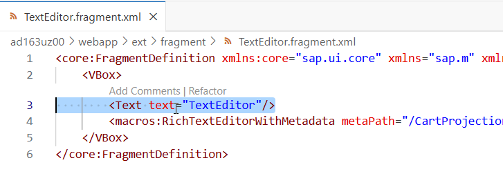

8. Now let's get back to the preview. If the preview is not running anymore you can restart it from the App Info Page or via right-click menu on your application project name in the Explorer. In the same way you can also bring back the App Info Page. **Remember** to select the preview option with mock data **start-mock**.

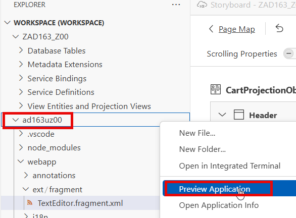

9. Finally let's try out the new capabilities provided by the Rich Text Editor. In the preview navigate to the detail object page of the first order, and switch to **Edit** mode. Now you can use the formatting options to emphasize your order notes. **Note:** You can save it here, but as we are using the mockserver to provide data, your changes are not written to the backend.

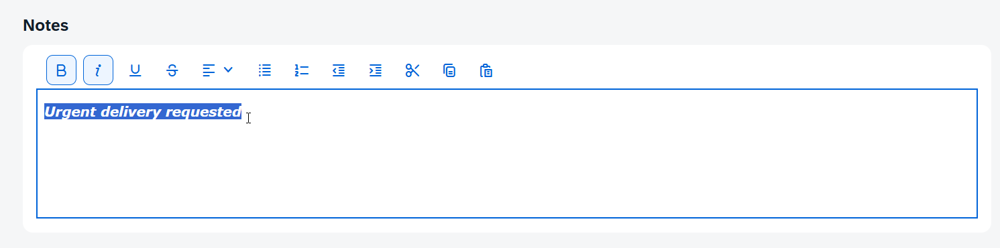

## Summary

You have learned:

* How to use Business Application Studio (BAS) and SAP Fiori tools to create a SAP Fiori elements application.
* How to preview an application with mock data.
* How to perform UI adaptations that cannot be achieved by using backend annotations.
* How to use building blocks and custom code to enrich your application further.

[^Top of page](#)
