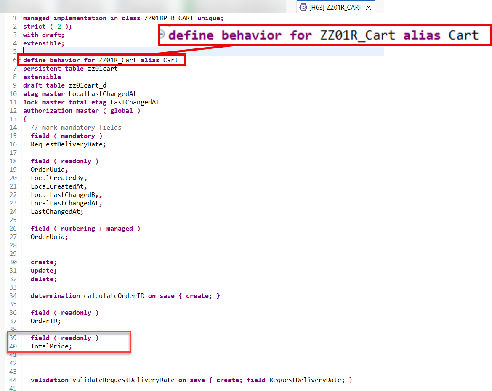
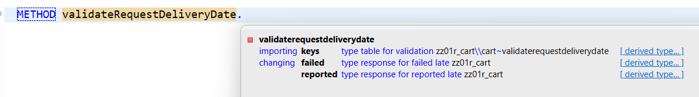
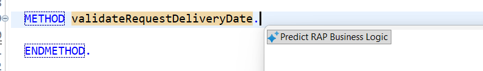
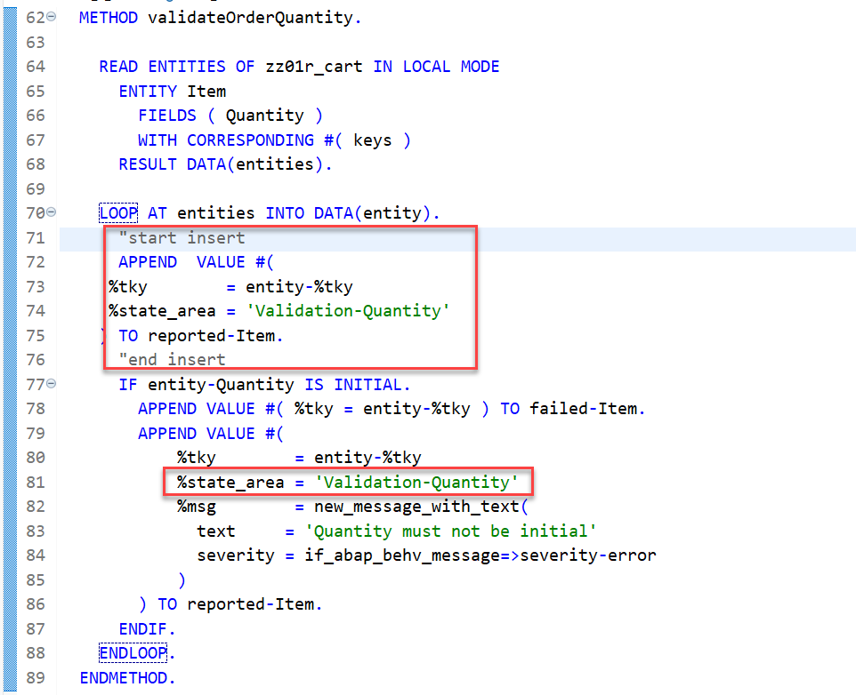

[Home - AD163](/README.md#exercises)

# Exercise 5: Complete the RAP implementation

## Introduction

Due to time-constraints we only implemented a very rudimentary business logic in Exercise 3.  

In this exercise, you will    
- add additonal determinations and validations to the behavior definition  
- implement these additional determinations and validations in the behavior implementation class
- make some fields read-only since they will be determined by the above mentioned additional determinations

### Exercise Steps

- [5.10 - Define derterminations](#310---define-determinations)
- [5.11 - Implement the determinations using Joule](#311---implement-the-determination-using-joule-)
- [5.12 - Define validations](#312---define-validations)
- [5.13 - Implement the validations using Joule](#313---implement-the-validations-using-joule-)
- [5.14 - Preview and test the enhanced online shop app](#314---preview-and-test-the-enhanced-online-shop-app)
- [Summary](#summary)


 


> ℹ️**Reminder:**   
> Don't forget to replace all occurences of the placeholder **`###`** with your suffix or Group ID in the exercise steps below.   
> You can use the ADT function **Replace All** (**Ctrl+F**) for this purpose. 


I
## 3.11 - Implement the determination using Joule 💎

In the following we will define additional determinations.

In the behavior definition for the `Item` entity you can define:        
- the determination `calculateItemID` to automatically calculate and set a semantic key for the field `ItemID`
- the determination `calculateItemPrice` 
  - to calculate the price of each item from the field `Quantity` and the value of the field `ItemUnitPrice` and
  - in addition to calculate the field `TotalPrice` of the `Cart` entity from the prices of all items.

<details>
<summary>Click to expand</summary>

1. Add the following statements to define the determination `calculateItemID` and the determination `calculateItemPrice` and add both to the behavior definition of the `Item` entity.  
The determination for the calculation of the `ItemPrice` and the `TotalPrice` shall be triggered each time when one of the fields `Quantity` or the `ItemUnitPrice` has changed because the user has selected a different material.  
In addition make the two fields read-only since their values will now be calculated by the aforementioned determinations:     

```ABAP
determination calculateItemID on save { create; }
determination calculateItemPrice on modify { field Quantity, ItemUnitPrice; }
  field ( readonly )
  ItemID,
  ItemPrice;
```
   So that the code now looks like follows:   

    

 2. Now, declare the required methods in behavior implementation class with the ADT Quick Fix.
  
   Set the cursor on the determination name **`calculateItemID`** and press **Ctrl+1** to open the **Quick Assist** view and select the entry _`Add  missing 2 methods of entity zr_AD163U### in local handler class lhc_zr_AD163U### ...`_ in the popup.   

   As result a `FOR DETERMINE` methods called **`calculateItemID`** and **`calculateItemPrice`** will be added to the local handler class **`lcl_item`** of the behavior pool of the _Item_ business object entity  **`ZBP_AD163U###`**.
    

3. Save  and activate  the changes in the local handler class **`lhc_cart`**.

4. In addition add the following statement to the behavior definition of the `Cart` entity since we will calculate the value of the field `TotalPrice` in the `Cart` entity as well.

```ABAP    
  field ( readonly )
  TotalPrice;
```  
    

5. Place the cursor behind the METHOD statements in the implementaton part of the local classes e.g. `METHOD calculateItemID.` and press **Ctrl+1** to start the quick assistant **Predict RAP business logic**.   

    

   and use the following prompts:  

   | Entity | Determination | Prompt |
   |------- | ------------------| -------------------------------------------------------- |
   | Item | `calculateItemID` | `Calculate a semantic key using the number of entries in table Z###ITEM`  |
   | Item | `calculateItemPrice`       | `Calculate ItemPrice from Quantity and ItemUnitPrice`    |


You should receive results like the following:

### calculateItemID

```ABAP
  METHOD calculateItemID.

  DATA: lv_count TYPE i,
        lv_semantic_key TYPE string.

  SELECT COUNT(*) FROM z###item INTO @lv_count.

  lv_semantic_key = |ITEM_{ lv_count }|.

  MODIFY ENTITIES OF z###r_cart IN LOCAL MODE
    ENTITY Item
      UPDATE FIELDS ( ItemID )
      WITH VALUE #(
        FOR key IN keys
        ( %tky = key-%tky
          ItemID = lv_semantic_key )
      ).
  ENDMETHOD.
```


### calculateItemPrice

```ABAP
METHOD calculateItemPrice.

    READ ENTITIES OF z###r_cart IN LOCAL MODE
      ENTITY Item
        FIELDS ( Quantity ItemUnitPrice )
        WITH CORRESPONDING #( keys )
      RESULT DATA(entities).

    LOOP AT entities INTO DATA(entity).
      DATA(lv_item_price) = entity-Quantity * entity-ItemUnitPrice.

      MODIFY ENTITIES OF z###r_cart IN LOCAL MODE
        ENTITY Item
          UPDATE FIELDS ( ItemPrice )
          WITH VALUE #(
            ( %tky = entity-%tky
              ItemPrice = lv_item_price )
          ).
    ENDLOOP.

    DATA update TYPE TABLE FOR UPDATE z###r_cart\\cart.
    DATA update_line TYPE STRUCTURE FOR UPDATE z###r_cart\\cart .


    " Read all parent UUIDs
    READ ENTITIES OF z###r_cart IN LOCAL MODE
      ENTITY Item BY \_Parent
        FIELDS ( OrderUuid  )
        WITH CORRESPONDING #(  keys  )
      RESULT DATA(Carts).

    LOOP AT carts INTO DATA(cart).

      update_line-%tky = cart-%tky.

      READ ENTITIES OF z###r_cart IN LOCAL MODE
            ENTITY cart BY \_Items
             "ALL FIELDS
             FIELDS
             ( ItemPrice   )
            WITH VALUE #( ( %tky = cart-%tky ) )
            RESULT DATA(items).

      LOOP AT items INTO DATA(item).
        update_line-TotalPrice += item-ItemPrice.
      ENDLOOP.

      APPEND update_line TO update.

    ENDLOOP.

    MODIFY ENTITIES OF z###r_cart IN LOCAL MODE
          ENTITY Cart
            UPDATE FIELDS ( TotalPrice )
            WITH CORRESPONDING #( update )

                REPORTED DATA(update_reported).

    reported = CORRESPONDING #( DEEP update_reported ).


  ENDMETHOD.
```


</details> 
 

## 3.12 - Define validations

In the previous exercises, you have defined and implemented determinations that run when the modification new and existing instances of the BO entity _Item_. 

Since the content (e.g. the field `Quantity`) can be invalid we would like to check the data quality upfront.   

<details>
<summary>Click to expand</summary>

In the present exercise, you're going to define and implement additional validations for  

- the fields `OrderedItem` and `Quantity` in the entity `Item`  

to check the following:

|Entity | Validation    | Purpose |
| -------- | -------- | ------- |
| Item | `validateOrderedItem` | The value shall shall not be initial and must exist in the cds view `ZAD163_I_PRODUCTS`    |
| Item | `validateOrderQuantity`    | The value for the field `Quantity` shall not be initial.   |

These validations are only performed in the back-end (not on the UI) and are triggered independently of the caller, i.e. Fiori UIs or EML APIs.


> ℹ **Frontend validation & Backend validations**
> Validations are used to ensure the data consistency.
> As the name suggests, **frontend validations** are performed on the UI. They are used to improve the user experience by providing faster feedback and avoiding unnecessary roundtrips. In the RAP context, front-end validations are defined using CDS annotation or UI logic.  
> On the other hand, **backend validations** are performed on the back-end. They are defined in the BO behavior definitons and implemented in the respective behavior pools.
> Frontend validations can be easily bypassed - e.g. by using EML APIs in the RAP context. Therefore, **backend validations are a MUST** to ensure the data consistency.

### About Validations

A validation is an optional part of the business object behavior that checks the consistency of business object instances based on trigger conditions.

A validation is implicitly invoked by the business object’s framework if the trigger condition of the validation is fulfilled. Trigger conditions can be `MODIFY` operations and modified fields. The trigger condition is evaluated at the trigger time, a predefined point during the BO runtime. An invoked validation can reject inconsistent instance data from being saved by passing the keys of failed instances to the corresponding table in the `FAILED` structure. Additionally, a validation can return messages to the consumer by passing them to the corresponding table in the `REPORTED` structure.

> **Further reading**: [Validations](https://help.sap.com/viewer/923180ddb98240829d935862025004d6/Cloud/en-US/171e26c36cca42699976887b4c8a83bf.html)

  
1. Open your behavior definition **`Z###R_Cart`** using ADT.    


2. Because empty values will not be accepted for the fields **`OrderedItem`**, **`RequestDeliveryDate`**, and **`OrderQuantity`**, specify them as _mandatory_ fields by adding the following code snippets at the top of both behavior definitions as shown on the screenshot below.
 
   - in the behavior definition of the `Cart` entity add the following code snippet:  

```ABAP  
  // mark mandatory fields
  field ( mandatory )
  RequestDeliveryDate;
```    
   - in the behavior definition of the `Item` entity add the follwoing code snippet: 

```ABAP  
  // mark mandatory fields
  field ( mandatory )
  Quantity,
  OrderedItem;
``` 

   Your source code should look like this:   

    

   and   
     
     

3. Define the validations **`validateOrderedItem`** and **`validateQuantity`**.

   For that, add the following code snippet after the determinations as shown on the screenshot below.
  
   - in the behavior definition of the `Item` entity add the follwoing code snippet: 

 ```ABAP      
      validation validateOrderQuantity on save { create; field Quantity; }
      validation validateOrderedItem on save { create; field OrderedItem; }
 ```   

4. In order to have draft instances being checked by validations before they become active, they have to be specified for the **`draft determine action prepare`** in the behavior definition.
  
   Enhance the **`draft determine action Prepare{...}`** statement with the following code snippet as shown on the screenshot below

```ABAP
    //draft determine action Prepare;
    draft determine action Prepare
    {     
     validation validateRequestDeliveryDate;
     // validations on item level
     validation item~validateOrderQuantity;
     validation item~validateOrderedItem;
    }
```

   Your source code should look like this: 

     

   **Short explanation**:
   - Validations are always invoked during the save and specified with the keyword `on save`.
 
 
   - `validateOrderQuantity` is a validation with trigger operation `create` and trigger field `OrderQuantity`   
   - `validateOrderedItem` is a validation with trigger operation `create`and trigger field `OrderedItem`   

   **ℹ Hint**:
   > In case a validation should be invoked at every change of the BO entity instance, then the trigger conditions `create`and `update`
   > must be specified: e.g. `validation validateRequestDeliveryDate on save { create; update; }`

5. Save  and activate  the changes.

6. Add the appropriate **`FOR VALIDATE ON SAVE`** methods to the local handler classes of the behavior pool of the _Item_ BO entity via quick fix.  

   For that, set the cursor on one of the validation names and press **Ctrl+1** to open the **Quick Assist** view and select the entries **`Add all 2 missing methods of entity z###r_item ...`** and **`Add method for validation validaterequestdata of entity z###r_cart...`** 

     

   As a result, the **`FOR VALIDATE ON SAVE`** methods **`validateOrderedItem`** and **`validateQuantity`** will be added to the local handler class `lhc_item` of the behavior pool `z###bp_r_cart` of the _Item_ BO entity.

7. Save  and activate  the changes.

> Hint:  
> If you get an error message in the behavior implementation `The entity "ZR_ITEM###" does not have a validation "VALIDATEORDERQUANTITY".` try to activate the behavior definition once again.  

</details>

## 3.13 - Implement the validations using Joule 💎   

In this exercise we will implement the previously created validations.

<details>
<summary>Click to expand</summary>
 

1. First, check the interface of the new methods in the declaration part of the local handler class `lhc_cart` of the behavior pool of the _Cart_ BO entity **`z###bp_r_cart`**.

   For that, set the cursor on the method name, e.g. **`validateOrderedItem`**, press **F2** to open the **ABAP Element Info** view, and examine the full method interface.

    

   **Short explanation**:  
   - The addition **`FOR VALIDATE ON SAVE`** indicates that the method provides the implementation of a validation executed on save. Validations are always executed on save.
   - Method signature for the validation method:
     - `IMPORTING`parameter **`keys`** - an internal table containing the keys of the instances on which the validation should be performed.
     - Implicit `CHANGING` parameters (aka _implicit response parameters_):  
       - **`failed`**   - table with information for identifying the data set where an error occurred
       - **`reported`** - table with data for instance-specific messages

   You can go ahead and implement the validation method.

2. Now implement the three methods in the implementation part of the class.
  
    The logic consists of the following main steps:
    1. Read the ShoppingCart instance(s) of the transferred keys (**`keys`**) using the EML statement **`READ ENTITIES`**.
    2. The addition **`FIELDS`** is used to specify the fields to be read. E.g. only **`OrderedItem`** is relevant for the  validation `validateOrderedItem`.  
       The addition `ALL FIELDS` can be used to read all fields.
    3. The addition **`IN LOCAL MODE`** is used to exclude feature controls and authorization checks.
    4. Read all the transfered (distinct, non-initial) customer IDs and check if they exist.  
    5. Prepare/raise messages for all transferred _ShoppingCart_ instances with initial and non-existing `OrderedItem`  
       and set the changing parameter **`reported`**


3. Now implement the method **`validateOrderQuantity`** in the implementation part of the local handler class. Place the cursor behind the statement `METHOD validateOrderQuantity.` and press **Ctrl+1** to start the quick assistant.

4. In the popup select **Predict RAP business logic**.  

   

5. Enter the following prompt:  
   **`Check that the field is not initial`**   
   in the dialogue box of the instant action and press **Run**.    

6. Check that the generated code looks like the following. 

   > ℹ️ Hint:
   > It is important that the code contains an `APPEND` statement that clears the state area within the `loop`statement, such as 
     ```ABAP
         APPEND  VALUE #(
          %tky        = entity-%tky
          %state_area = 'Validation-Quantity'
         ) TO reported-Item.
     ```  
   > And the state area should have a unique value, so change the value `validation` to something like `validation-Quantity`.    

   

   A working implementation looks like follows:  

 ```ABAP
  METHOD validateOrderQuantity.

    READ ENTITIES OF z###r_cart IN LOCAL MODE
      ENTITY Item
        FIELDS ( Quantity )
        WITH CORRESPONDING #( keys )
      RESULT DATA(entities).

    LOOP AT entities INTO DATA(entity).
      APPEND VALUE #(
          %tky        = entity-%tky
          %state_area = 'Validation-Quantity'
      ) TO reported-Item.

      IF entity-Quantity IS INITIAL.
        APPEND VALUE #( %tky = entity-%tky ) TO failed-Item.
        APPEND VALUE #(
            %tky        = entity-%tky
            %state_area = 'Validation-Quantity'
            %msg        = new_message_with_text(
              text     = 'Quantity must not be initial.'
              severity = if_abap_behv_message=>severity-error
            )
        ) TO reported-Item.
      ENDIF.
    ENDLOOP.

  ENDMETHOD.

 ```


5. Next implement   
   - the method  `validateOrderedItem` in the implementation part of the local handler class `lhc_item` and
   - the method `validateRequestDeliveryDate` in the implementation part of the local handler class `lhc_cart`
   and use the following prompts:

| validation    | Savings |
| -------- | ------- |
|  `validateOrderedItem` | `Check that the field is not initial and that the value is in the cds view ZAD163_I_PRODUCTS`    |
| `validateRequestDeliveryDate` | `Check that the field is not initial and that the date entered in the field is in the future. Do not use the outdated sy-datum statement.` |

7. Check that the generated code looks like follows:

### validateOrderedItem

```ABAP  
  METHOD validateOrderedItem.

    READ ENTITIES OF z###r_cart IN LOCAL MODE
      ENTITY Item
        FIELDS ( OrderedItem )
        WITH CORRESPONDING #( keys )
      RESULT DATA(entities).

    LOOP AT entities INTO DATA(entity).
      APPEND VALUE #(
          %tky        = entity-%tky
          %state_area = 'Validation-OrderedItem'
      ) TO reported-Item.

      IF entity-OrderedItem IS INITIAL.
        APPEND VALUE #( %tky = entity-%tky ) TO failed-Item.
        APPEND VALUE #(
            %tky        = entity-%tky
            %state_area = 'Validation-OrderedItem'
            %msg        = new_message_with_text(
              text     = 'OrderedItem must not be initial.'
              severity = if_abap_behv_message=>severity-error
            )
        ) TO reported-Item.
      ELSE.
        SELECT SINGLE * FROM zad163_i_products
          WHERE material = @entity-OrderedItem
          INTO @DATA(lv_product).

        IF sy-subrc <> 0.
          APPEND VALUE #( %tky = entity-%tky ) TO failed-Item.
          APPEND VALUE #(
              %tky        = entity-%tky
              %state_area = 'Validation-OrderedItem'
              %msg        = new_message_with_text(
                text     = 'OrderedItem is not valid.'
                severity = if_abap_behv_message=>severity-error
              )
          ) TO reported-Item.
        ENDIF.
      ENDIF.
    ENDLOOP.


  ENDMETHOD.
```


### validateRequestDeliveryDate

```ABAP    
  METHOD validateRequestDeliveryDate.

    READ ENTITIES OF z###r_cart IN LOCAL MODE
      ENTITY Cart
        FIELDS ( RequestDeliveryDate )
        WITH CORRESPONDING #( keys )
      RESULT DATA(entities).

    DATA(current_date) = cl_abap_context_info=>get_system_date( ).

    LOOP AT entities INTO DATA(entity).
      APPEND VALUE #(  %tky               = entity-%tky
                       %state_area        = 'Validation-RequestDeliveryDate'
                     ) TO reported-cart.
      IF entity-RequestDeliveryDate IS INITIAL OR entity-RequestDeliveryDate <= current_date.
        APPEND VALUE #( %tky = entity-%tky ) TO failed-Cart.
        APPEND VALUE #(
            %tky        = entity-%tky
            %state_area = 'Validation-RequestDeliveryDate'
            %msg        = new_message_with_text(
              text     = 'RequestDeliveryDate must be in the future and not initial.'
              severity = if_abap_behv_message=>severity-error
            )
        ) TO reported-Cart.
      ENDIF.
    ENDLOOP.
  ENDMETHOD.
```

</details>

## 3.14 - Preview and Test the enhanced Online Shop App

> Now the SAP Fiori elements app can be tested.    

You can either refresh your application in the browser using **F5** if the browser is still open - or go to your service binding **`ZUI_AD163U###_O4`** and start the Fiori elements App preview for the **`CartProjection`** entity set.

<details>
<summary>Click to expand</summary>

1. Click **Create** to create a new entry.

2. Select `HT-1000` as OrderdItem, enter an quantity and a requested delivery date **that lies in the past**. 

   The draft will be updated.

3. Now click **Create**. You should get following error messages displayed:  
   **Requested delivery date is in the past** .

    

</details>

## Summary 

Now that you have... 

- defined determinations and validations in the behavior definition, 
- implemented them in the behavior pool, and
- previewed and tested the enhanced Fiori elements app,

you are finished also with the optional ABAP related exercises.

[^Top of page](#)
